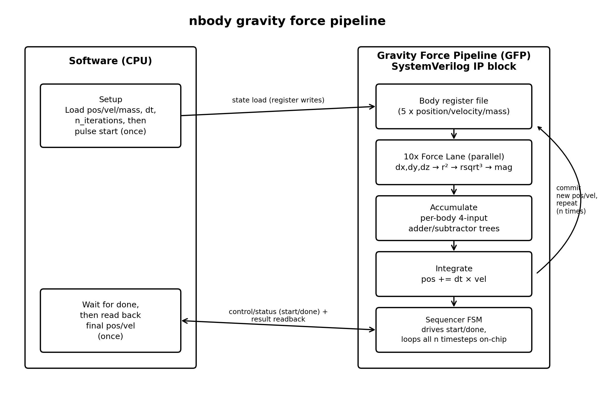

# nbody — Hardware Acceleration Proposal (Section 9)

Targets `advance()`'s pairwise gravitational-force update
(`nbody/original/run_benchmark.py`, lines 78-97) — the loop responsible
for essentially all of nbody's runtime, and the source of the two
bottlenecks identified in [BOTTLENECKS.md](BOTTLENECKS.md): ~29%
self-time in raw interpreter dispatch (`_PyEval_EvalFrameDefault`) and
~9.3% self-time purely boxing/deallocating temporary `PyFloat` objects.
Software's best fix within CPython — manual loop unrolling
([optimized_unroll_experiment/](optimized_unroll_experiment/), Attempt
4 — see [OPTIMIZATIONS.md](OPTIMIZATIONS.md)) — only recovered ~9%,
because it can't remove the object-boxing execution model itself, only
reduce how many times it's paid. That's precisely what dedicated
hardware removes entirely.

RTL: [`hardware/gravity_force_pipeline.sv`](hardware/gravity_force_pipeline.sv)
(SystemVerilog; syntax-checked with Icarus Verilog `-g2012`, no errors
or warnings). Not tapeout-ready — no FP exception handling, no reset
synchronizers/CDC — but a complete, logically consistent design: real
port lists, a real datapath (10 parallel force-compute lanes, per-body
accumulate trees, position integration), and a real control FSM.

## Hardware description

The **Gravity Force Pipeline (GFP)**: a SystemVerilog IP block that
holds all 5 bodies' state on-chip and runs the *entire* `advance(dt,
n)` call — all `n` timesteps — internally, without any per-timestep
round trip back to the CPU.

This is the key architectural difference from pyflate's accelerator
(see [pyflate/report_pyflate.txt](../pyflate/report_pyflate.txt)'s
Hardware Acceleration Proposal): pyflate's HFDU streams a large,
unbounded bitstream through a fixed-latency lookup — the *data volume*
is the challenge. nbody's entire working set is tiny — 5 bodies ×
(position + velocity + mass) = 35 doubles, ~280 bytes — and stays
constant for the whole call. The challenge here isn't data volume, it's
*call count*: `advance()` re-enters the same 6-line pairwise
computation 200,000+ times per benchmark loop (20,000 iterations × 10
pairs), and every one of those re-entries pays CPython's interpreter
dispatch and float-boxing cost. Moving the *entire* timestep loop onto
hardware — not just one pairwise computation — is what removes that
cost, since software now issues one `start` pulse per `advance()` call
instead of 200,000 individual arithmetic operations.

## Inputs and outputs

- **Control/status** (memory-mapped register file, AXI-Lite style):
  `start`, `done`, `n_iterations` (32-bit), `dt` (64-bit IEEE-754
  double).
- **State load/readback port**: one body-field per cycle —
  `state_body_idx` (3 bits, 0-4), `state_field_sel` (2 bits:
  position/velocity/mass), `state_axis_sel` (2 bits: x/y/z),
  `state_wr_data`/`state_rd_data` (64-bit). The whole 35-double state
  loads or reads back in ~35 cycles — negligible next to
  `n_iterations` × 10-pair timesteps, so no DMA burst interface is
  needed (unlike pyflate, where the bitstream volume justifies one).
- **Target frequency**: 200-400 MHz for an FPGA prototype, matching
  pyflate's HFDU estimate (same target platform class); a full-custom
  ASIC of the same logic would clock significantly higher.

## Hardware architecture

- **Body register file**: `pos[5][3]`, `vel[5][3]`, `mass[5]`, all
  64-bit IEEE-754 doubles — matches CPython's float representation
  exactly, so no precision loss versus the reference implementation.
- **10 parallel Force Lanes** (`force_lane` module): one per body pair,
  with the pair-to-body-index mapping (`pair_i()`/`pair_j()`) fixed at
  synthesis time — this is the hardware analogue of the software
  "manual unrolling" optimization (Attempt 4), taken to its logical
  end: instead of unrolling a loop in a still-interpreted language,
  it's fixed wiring between 10 lane instances and the register file, so
  all 10 pairs evaluate **simultaneously**, not sequentially. Each lane
  computes `dx,dy,dz → r² → rsqrt³ → mag → six velocity-delta terms`,
  matching `advance()`'s arithmetic exactly (see the module's header
  comment for the stage-by-stage breakdown). The reciprocal-sqrt-cubed
  step is delegated to a standard pipelined FP IP core (`fp_rsqrt3`) —
  every FPGA/ASIC FP library ships one, so it's declared as a black box
  here rather than re-derived.
- **Accumulate stage**: each body appears in exactly 4 of the 10 pairs
  (fixed, known at synthesis time), so this is a *static* 4-input
  adder/subtractor tree per (body, axis) — 15 trees total — not a
  dynamic scatter-add. This is the hardware analogue of the numpy
  scatter-add approach that *lost* in software (Attempt 1, see
  [OPTIMIZATIONS.md](OPTIMIZATIONS.md)) purely on per-call dispatch
  overhead: in hardware there is no dispatch overhead, so the same
  underlying idea (batch the scatter-add) wins here where it didn't in
  Python.
- **Integrate stage**: `pos[b][axis] += dt * vel[b][axis]` for all 5
  bodies, via one `fp_mul` + `fp_add` pair per (body, axis).
- **Sequencer FSM**: `IDLE → LOAD → FORCE → ACCUMULATE → INTEGRATE →
  (loop FORCE for n_iterations) → DONE`. The loop back to `FORCE`
  happens entirely on-chip — software is not involved until `done`
  asserts after all `n` timesteps complete.

## Hardware/software interface

Software's role shrinks to almost nothing per timestep, unlike
pyflate's design where software still parses block headers every
block: here, software (1) writes the initial state and `dt`/`n` into
the register file, (2) pulses `start`, (3) polls (or is interrupted by)
`done`, (4) reads back the final `pos`/`vel`. No DMA channel is
needed — register writes are the whole interface, since the data
volume (280 bytes, once) is trivial. The `report_energy()` calls that
bracket each `advance()` call in `bench_nbody()` stay in software
unchanged, since they're called far less often (twice per benchmark
loop vs. `advance()`'s 20,000 internal iterations) and weren't the
profiled hotspot.

## Acceleration justification

`advance()`'s bottleneck isn't an inefficient algorithm — the pairwise
loop is already the correct O(pairs) approach, and
[OPTIMIZATIONS.md](OPTIMIZATIONS.md) shows three of four software
attempts to speed it up *within CPython* made things worse. The cost is
structural: every scalar float operation in CPython allocates a heap
object, and every iteration re-enters the bytecode interpreter. Neither
of those costs exists in hardware — a `force_lane` computing `dx = x1 -
x2` is a wire and a subtractor, not a heap allocation. Combined with
running all 10 pairs in parallel (not sequentially) and keeping the
entire `n`-timestep loop on-chip (not one CPU↔accelerator round trip
per timestep), this removes both identified bottlenecks at their root
rather than reducing their cost, which is what every software attempt
was limited to.

Estimated improvement: software's own best-case reduction (loop
unrolling) removed ~9% by cutting redundant interpreter re-entries
without touching the underlying per-op cost. Hardware removes the
per-op cost itself (no interpreter, no boxing) and parallelizes across
all 10 pairs, so the realistic ceiling is much higher — the timestep
loop's critical path becomes the `force_lane` pipeline depth (~12
cycles, dominated by the FP reciprocal-sqrt-cube unit) plus a small
constant for accumulate/integrate, independent of how many times
`advance()` is called. This is an architectural estimate, not a
measured one — no FPGA/ASIC implementation was built or timed, per the
assignment's scope (RTL design and specification, not synthesis or
fabrication).

## Block diagram

Software (left) loads the 5-body state and pulses `start` once per
`advance()` call; the GFP (right) runs its register file through the
force-lane → accumulate → integrate chain, looping internally for all
`n` timesteps before asserting `done` and letting software read back
the final state. Compare against
[pyflate's block diagram](../pyflate/hardware/block_diagram.png), whose
software side stays *in the loop* every block (parsing headers, DMAing
tables) — the structural difference between the two designs mirrors
the structural difference between the two benchmarks' bottlenecks
(streaming-data lookup vs. call-count/interpreter overhead).

## Performance/area/power trade-offs

- **Performance**: critical path is the `force_lane` pipeline depth
  (dominated by the FP reciprocal-sqrt-cube unit), amortized across all
  10 pairs evaluating in parallel and all `n` timesteps running without
  CPU round trips. The accumulate stage's 4-input adder/subtractor
  trees add a small, fixed number of cycles per timestep on top of that.
- **Area**: modest and dominated by the 10 `force_lane` instances, each
  containing several 64-bit FP multiply/add/subtract units plus one
  FP reciprocal-sqrt-cube unit (the most area-hungry component per
  lane). Ten parallel lanes cost 10x one lane's FP-unit area — a real
  trade-off against a design that time-multiplexes fewer FP units
  across the 10 pairs sequentially, trading area for the latency win of
  full parallelism. Given the assignment's target problem size (5
  bodies), full parallelism is affordable; a larger N-body problem
  would need to revisit this trade-off (batching pairs through fewer
  shared lanes) since lane count grows as O(bodies²).
- **Power**: dominated by the 10 parallel FP pipelines running every
  cycle of every timestep — higher instantaneous power than pyflate's
  HFDU (which only activates table lookups when bits are actually
  consumed), but for a much shorter total active time per equivalent
  unit of work, since there's no interpreter overhead inflating cycle
  count. No general-purpose fetch/decode/dispatch overhead at all,
  unlike running the same arithmetic through a CPU.
- **Trade-off made explicitly**: running all 10 pairs in parallel
  (rather than time-multiplexing fewer lanes) trades area for
  eliminating any sequencing overhead between pairs — appropriate here
  specifically because 10 is small; this would not scale directly to
  a much larger N-body problem without redesign.

## Conclusion

nbody's structural bottleneck — CPython's per-operation object
allocation and interpreter dispatch overhead — is exactly the kind of
cost that only a different execution model can remove, as
[OPTIMIZATIONS.md](OPTIMIZATIONS.md#conclusion) concluded. The Gravity
Force Pipeline targets that directly: moving the entire pairwise force
computation, accumulation, and position integration into fixed-function
hardware, parallelized across all 10 pairs and looped internally for
all `n` timesteps, removes both identified bottlenecks (interpreter
dispatch, float boxing) at the root rather than reducing how often
they're paid, which is the ceiling every software attempt in
[OPTIMIZATIONS.md](OPTIMIZATIONS.md) ran into.
